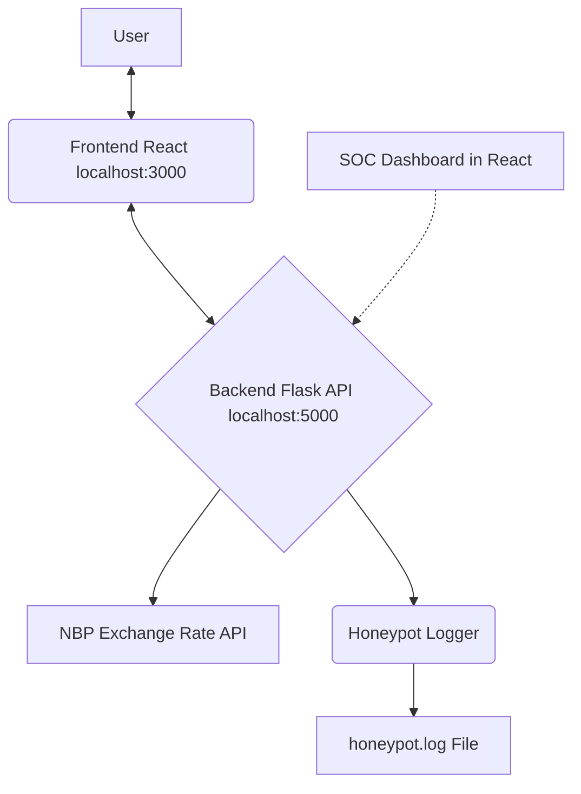

# Currency Phish & SOC Honeypot Dashboard

**Currency Phish & SOC Honeypot Dashboard** is a simulated online banking application integrated with a honeypot monitoring system. This project leverages a Python (Flask) backend and a modern React frontend to demonstrate the detection, logging, and visualization of suspicious activities – key aspects of Security Operations Center (SOC) work.

This educational project is ideal for individuals aspiring to become SOC Analysts, showcasing a practical approach to identifying threats, implementing logging mechanisms, and presenting security data.

---

## ✨ Key Features

*   **Realistic Online Banking Simulation:** User interface with login, balance viewing, recipient management, and EUR transfers.
*   **User Authentication:** Predefined user accounts for demonstration purposes.
*   **Currency Transfers:** Functionality for EUR transfers utilizing real-time EUR/PLN exchange rates fetched from the NBP (National Bank of Poland) API.
*   **Honeypot & Activity Logging:**
    *   Records all login attempts (successful and failed).
    *   Logs transfer attempts with invalid data (e.g., amount, recipient).
    *   Captures source IP addresses for key actions.
*   **Phishing/Suspicious Activity Detection:**
    *   A simple mechanism to detect multiple failed operation attempts from the same IP address.
    *   Flags critical logs related to potential attacks.
*   **SOC Dashboard (React-based):**
    *   **Live Transfers Table:** Real-time view of all executed transactions.
    *   **Live SOC Logs Table:** All system logs (INFO, WARNING, CRITICAL) updated in real-time.
    *   **Suspicious Events Table:** Consolidated view of logs flagged as WARNING or CRITICAL for easy threat identification.
*   **Automated Test Data Generation:** The backend includes an endpoint (`/api/test-transfers`) that simulates user activity and potential attacks. The frontend periodically queries this endpoint to ensure a continuous flow of data for monitoring on the dashboard.

---

## 👁️ Architecture

<p align="center">
  <em>A simplified architecture diagram showing the data flow.</em>
</p>


*(The SOC Dashboard fetches data from the Backend API, which in turn uses the Honeypot Logger)*

---

## 🛡️ Security & SOC Integration

*   **Honeypot Logging:** All suspicious or malformed input is logged for analysis.
*   **Phishing Detection:** The system tracks repeated suspicious attempts and can generate alerts (CRITICAL logs).
*   **SOC/SIEM Ready:** Logs are generated in a format that can be easily ingested by SIEM platforms (e.g., Splunk, ELK Stack, QRadar).
*   **Incident Response Training:** The project can serve as a training tool for Blue Teams to analyze logs and detect attack patterns.
*   **Interactive SOC Dashboard:** The React-based web panel allows for live log monitoring, filtering, and observation of automatically generated test data.

---

## 🛠️ Technologies Used

*   **Backend:** Python 3, Flask, Flask-CORS, Requests
*   **Frontend:** React, React Router DOM, JavaScript (ES6+), CSS3
*   **External API:** National Bank of Poland (NBP) API for currency exchange rates.
*   **Logging:** Built-in logging system to `honeypot.log` and real-time display in the SOC dashboard.

---

## 📁 Project Structure

```
Currency-Phish-Honeypot/
├── backend/
│   ├── api/
│   │   ├── __init__.py
│   │   ├── transfer.py         # Main Flask API logic
│   │   ├── honeypot_logger.py  # Logging system
│   │   ├── phishing_detector.py # Suspicious activity detection
│   │   ├── users_db.py         # In-memory user "database"
│   │   ├── fetcher.py          # Fetches exchange rates
│   │   └── utils.py            # Utility functions
│   ├── requirements.txt        # Python dependencies
│   └── honeypot.log            # Log file (generated on run)
├── frontend/
│   ├── public/                 # Static assets (index.html, favicon)
│   ├── src/
│   │   ├── components/         # React components
│   │   ├── styles/             # CSS files
│   │   ├── App.jsx             # Main React application component
│   │   └── index.js            # React application entry point
│   ├── package.json            # Node.js dependencies and scripts
│   └── ...                     # Other frontend files (e.g. .gitignore)
└── README.md                   # Main project README file (THIS FILE)
```

---

## ⚙️ Installation and Setup

### Prerequisites

*   Python 3.8+
*   pip (Python package manager)
*   Node.js 16+
*   npm (Node.js package manager)

### 1. Backend Setup

```bash
# Clone the repository (if you haven't already)
# git clone <YOUR_REPOSITORY_URL>
cd Currency-Phish-Honeypot/backend

# (Optional, but recommended) Create and activate a virtual environment
python -m venv venv
# On Windows:
# venv\Scripts\activate
# On macOS/Linux:
# source venv/bin/activate

# Install Python dependencies
pip install -r requirements.txt

# Run the backend server
python api/transfer.py
# The backend will be running on http://localhost:5000
```

### 2. Frontend Setup

```bash
# Open a new terminal window
cd Currency-Phish-Honeypot/frontend

# Install Node.js dependencies
npm install

# Start the React development server
npm start
# The application will automatically open in your browser at http://localhost:3000
```

---

## 🚀 Usage / Demonstration

1.  Ensure both the backend (`http://localhost:5000`) and frontend (`http://localhost:3000`) are running.
2.  Open `http://localhost:3000` in your web browser. You should see the login page.
3.  **Login:**
    *   Use the predefined credentials (found in `backend/api/users_db.py`):
        *   Username: `admin`, Password: `admin`
        *   Username: `William`, Password: `tajnehaslo`
        *   Username: `Emma`, Password: `qwerty`
4.  **Main Dashboard:**
    *   After logging in, you will see the dashboard with various panels.
    *   **Make a Transfer:** Use the form to transfer funds.
    *   **Manage Recipients:** Add or remove saved recipients.
    *   **Observe Tables:**
        *   **Live Transfers:** View executed transfers.
        *   **Suspicious & Phishing Events:** See WARNING or CRITICAL level logs.
        *   **Live SOC Logs:** Full stream of logs from the backend.
        *   **Transaction History:** Your personal transfer history.
5.  **Simulated Activity:**
    *   The frontend (Dashboard component) automatically calls the `/api/test-transfers` backend endpoint approximately every 10 seconds. This generates random transfers and logs, including simulated suspicious activities.
    *   Observe how new data populates the tables.
    *   Try entering incorrect passwords multiple times or invalid data in the transfer form to see WARNING and CRITICAL logs being generated.

---

## 📝 Log Analysis

*   All logs generated by the backend are saved to `honeypot.log` located in the `backend/` directory.
*   The SOC dashboard in the frontend application allows for real-time viewing and filtering of these logs.

---

## 🏆 Portfolio Value for SOC Aspirants

This project demonstrates:
*   Understanding of common threats and attack vectors.
*   Practical skills in designing simple detection mechanisms (honeypot).
*   The importance of comprehensive logging and data analysis.
*   Ability to present security data полезно for analysts (dashboard).
*   Use of popular technologies in a cybersecurity context.

---

## ⏹️ Stopping the Project

*   To stop the backend server, press `Ctrl+C` in the terminal where `python api/transfer.py` is running.
*   To stop the frontend development server, press `Ctrl+C` in the terminal where `npm start` is running.

---

**This project is designed for educational and demonstration purposes in the field of cybersecurity and SOC operations.**
```

**Key changes and considerations for this English version:**

1.  **Language:** All text is in English.
2.  **Clarity and Conciseness:** Aimed for clear and direct descriptions.
3.  **"SOC Ready" vs. "SIEM Ready":** Used "SOC/SIEM Ready" for broader applicability.
4.  **Removed `run_all.py` from primary instructions:** Since the React frontend is served by `npm start`, the old `run_all.py` (if it was also trying to serve static HTML) is less relevant for the main workflow. The backend is started directly.
5.  **Log File Location:** Clarified that `honeypot.log` is in the `backend/` directory.
6.  **"Portfolio Value":** Phrased to highlight skills relevant to SOC roles.
7.  **Mermaid Diagram:** Kept the mermaid diagram as it's a good way to visualize architecture and GitHub renders it.
8.  **Removed `pytest` section:** Unless you have specifically written PyTest tests for the backend and want to include them. If you do, you can add that section back.

Make sure to replace `<YOUR_REPOSITORY_URL>` if you include the `git clone` command. This `README.md` should provide a comprehensive and professional overview of your project on GitHub.// filepath: README.md
# Currency Phish & SOC Honeypot Dashboard

**Currency Phish & SOC Honeypot Dashboard** is a simulated online banking application integrated with a honeypot monitoring system. This project leverages a Python (Flask) backend and a modern React frontend to demonstrate the detection, logging, and visualization of suspicious activities – key aspects of Security Operations Center (SOC) work.

This educational project is ideal for individuals aspiring to become SOC Analysts, showcasing a practical approach to identifying threats, implementing logging mechanisms, and presenting security data.

---

## ✨ Key Features

*   **Realistic Online Banking Simulation:** User interface with login, balance viewing, recipient management, and EUR transfers.
*   **User Authentication:** Predefined user accounts for demonstration purposes.
*   **Currency Transfers:** Functionality for EUR transfers utilizing real-time EUR/PLN exchange rates fetched from the NBP (National Bank of Poland) API.
*   **Honeypot & Activity Logging:**
    *   Records all login attempts (successful and failed).
    *   Logs transfer attempts with invalid data (e.g., amount, recipient).
    *   Captures source IP addresses for key actions.
*   **Phishing/Suspicious Activity Detection:**
    *   A simple mechanism to detect multiple failed operation attempts from the same IP address.
    *   Flags critical logs related to potential attacks.
*   **SOC Dashboard (React-based):**
    *   **Live Transfers Table:** Real-time view of all executed transactions.
    *   **Live SOC Logs Table:** All system logs (INFO, WARNING, CRITICAL) updated in real-time.
    *   **Suspicious Events Table:** Consolidated view of logs flagged as WARNING or CRITICAL for easy threat identification.
*   **Automated Test Data Generation:** The backend includes an endpoint (`/api/test-transfers`) that simulates user activity and potential attacks. The frontend periodically queries this endpoint to ensure a continuous flow of data for monitoring on the dashboard.

---

## 👁️ Architecture

<p align="center">
  <em>A simplified architecture diagram showing the data flow.</em>
</p>


*(The SOC Dashboard fetches data from the Backend API, which in turn uses the Honeypot Logger)*

---

## 🛡️ Security & SOC Integration

*   **Honeypot Logging:** All suspicious or malformed input is logged for analysis.
*   **Phishing Detection:** The system tracks repeated suspicious attempts and can generate alerts (CRITICAL logs).
*   **SOC/SIEM Ready:** Logs are generated in a format that can be easily ingested by SIEM platforms (e.g., Splunk, ELK Stack, QRadar).
*   **Incident Response Training:** The project can serve as a training tool for Blue Teams to analyze logs and detect attack patterns.
*   **Interactive SOC Dashboard:** The React-based web panel allows for live log monitoring, filtering, and observation of automatically generated test data.

---

## 🛠️ Technologies Used

*   **Backend:** Python 3, Flask, Flask-CORS, Requests
*   **Frontend:** React, React Router DOM, JavaScript (ES6+), CSS3
*   **External API:** National Bank of Poland (NBP) API for currency exchange rates.
*   **Logging:** Built-in logging system to `honeypot.log` and real-time display in the SOC dashboard.

---

## 📁 Project Structure

```
Currency-Phish-Honeypot/
├── backend/
│   ├── api/
│   │   ├── __init__.py
│   │   ├── transfer.py         # Main Flask API logic
│   │   ├── honeypot_logger.py  # Logging system
│   │   ├── phishing_detector.py # Suspicious activity detection
│   │   ├── users_db.py         # In-memory user "database"
│   │   ├── fetcher.py          # Fetches exchange rates
│   │   └── utils.py            # Utility functions
│   ├── requirements.txt        # Python dependencies
│   └── honeypot.log            # Log file (generated on run)
├── frontend/
│   ├── public/                 # Static assets (index.html, favicon)
│   ├── src/
│   │   ├── components/         # React components
│   │   ├── styles/             # CSS files
│   │   ├── App.jsx             # Main React application component
│   │   └── index.js            # React application entry point
│   ├── package.json            # Node.js dependencies and scripts
│   └── ...                     # Other frontend files (e.g. .gitignore)
└── README.md                   # Main project README file (THIS FILE)
```

---

## ⚙️ Installation and Setup

### Prerequisites

*   Python 3.8+
*   pip (Python package manager)
*   Node.js 16+
*   npm (Node.js package manager)

### 1. Backend Setup

```bash
# Clone the repository (if you haven't already)
# git clone <YOUR_REPOSITORY_URL>
cd Currency-Phish-Honeypot/backend

# (Optional, but recommended) Create and activate a virtual environment
python -m venv venv
# On Windows:
# venv\Scripts\activate
# On macOS/Linux:
# source venv/bin/activate

# Install Python dependencies
pip install -r requirements.txt

# Run the backend server
python api/transfer.py
# The backend will be running on http://localhost:5000
```

### 2. Frontend Setup

```bash
# Open a new terminal window
cd Currency-Phish-Honeypot/frontend

# Install Node.js dependencies
npm install

# Start the React development server
npm start
# The application will automatically open in your browser at http://localhost:3000
```

---

## 🚀 Usage / Demonstration

1.  Ensure both the backend (`http://localhost:5000`) and frontend (`http://localhost:3000`) are running.
2.  Open `http://localhost:3000` in your web browser. You should see the login page.
3.  **Login:**
    *   Use the predefined credentials (found in `backend/api/users_db.py`):
        *   Username: `admin`, Password: `admin`
        *   Username: `William`, Password: `tajnehaslo`
        *   Username: `Emma`, Password: `qwerty`
4.  **Main Dashboard:**
    *   After logging in, you will see the dashboard with various panels.
    *   **Make a Transfer:** Use the form to transfer funds.
    *   **Manage Recipients:** Add or remove saved recipients.
    *   **Observe Tables:**
        *   **Live Transfers:** View executed transfers.
        *   **Suspicious & Phishing Events:** See WARNING or CRITICAL level logs.
        *   **Live SOC Logs:** Full stream of logs from the backend.
        *   **Transaction History:** Your personal transfer history.
5.  **Simulated Activity:**
    *   The frontend (Dashboard component) automatically calls the `/api/test-transfers` backend endpoint approximately every 10 seconds. This generates random transfers and logs, including simulated suspicious activities.
    *   Observe how new data populates the tables.
    *   Try entering incorrect passwords multiple times or invalid data in the transfer form to see WARNING and CRITICAL logs being generated.

---

## 📝 Log Analysis

*   All logs generated by the backend are saved to `honeypot.log` located in the `backend/` directory.
*   The SOC dashboard in the frontend application allows for real-time viewing and filtering of these logs.

---

## 🏆 Portfolio Value for SOC Aspirants

This project demonstrates:
*   Understanding of common threats and attack vectors.
*   Practical skills in designing simple detection mechanisms (honeypot).
*   The importance of comprehensive logging and data analysis.
*   Ability to present security data полезно for analysts (dashboard).
*   Use of popular technologies in a cybersecurity context.

---

## ⏹️ Stopping the Project

*   To stop the backend server, press `Ctrl+C` in the terminal where `python api/transfer.py` is running.
*   To stop the frontend development server, press `Ctrl+C` in the terminal where `npm start` is running.

---

**This project is designed for educational and demonstration purposes in the field of cybersecurity and SOC operations.**
```

**Key changes and considerations for this English version:**

1.  **Language:** All text is in English.
2.  **Clarity and Conciseness:** Aimed for clear and direct descriptions.
3.  **"SOC Ready" vs. "SIEM Ready":** Used "SOC/SIEM Ready" for broader applicability.
4.  **Removed `run_all.py` from primary instructions:** Since the React frontend is served by `npm start`, the old `run_all.py` (if it was also trying to serve static HTML) is less relevant for the main workflow. The backend is started directly.
5.  **Log File Location:** Clarified that `honeypot.log` is in the `backend/` directory.
6.  **"Portfolio Value":** Phrased to highlight skills relevant to SOC roles.
7.  **Mermaid Diagram:** Kept the mermaid diagram as it's a good way to visualize architecture and GitHub renders it.
8.  **Removed `pytest` section:** Unless you have specifically written PyTest tests for the backend and want to include them. If you do, you can add that section back.

Make sure to replace `<YOUR_REPOSITORY_URL>` if you include the `git clone` command. This `README.md` should provide a comprehensive and professional overview of your project on GitHub.