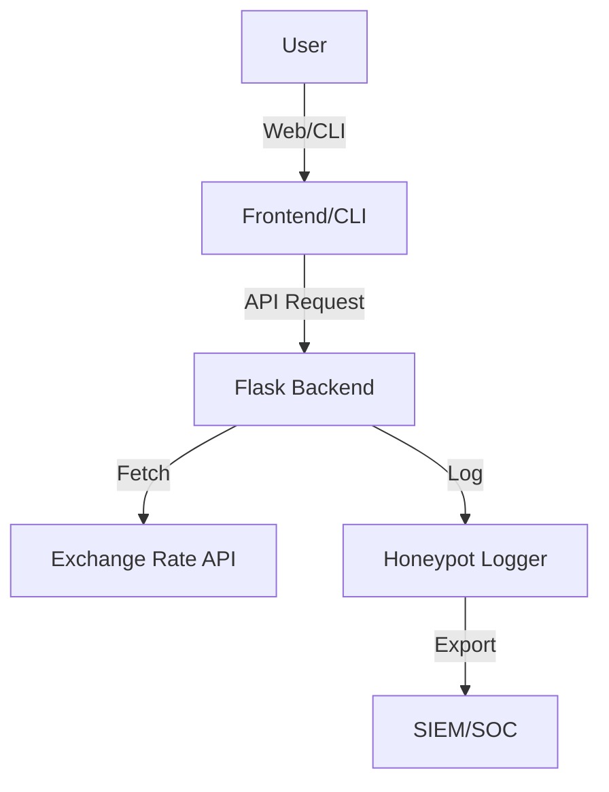

# Currency-Phish-Honeypot

A Python-based honeypot and security monitoring project that retrieves real-time EUR to PLN exchange rates, detects suspicious activities, and demonstrates SOC-ready logging and detection techniques.

---

## Features

- Fetches the current EUR to PLN exchange rate from a public API.
- Converts user-input EUR amounts to PLN.
- Logs suspicious or malformed input for further security analysis.
- Detects phishing attempts and abnormal user behavior.
- Integrates with SIEM/SOC tools via log files.
- Implements basic honeypot logic for cyber threat research.
- CLI and web frontend (Flask API + HTML/JS).

---

## Architecture



---

## Security & SOC Integration

- **Honeypot Logging:** All suspicious or malformed input is logged for further analysis.
- **Phishing Detection:** The system tracks repeated suspicious attempts and can trigger alerts.
- **SOC Ready:** Logs are formatted for easy ingestion by SIEM/SOC platforms (Splunk, ELK, QRadar, etc.).
- **Incident Response:** The project can be used as a training tool for blue teamers to analyze logs and detect attack patterns.
- **Sample SIEM Query:**  
  _Splunk:_  
  `index=honeypot_logs "Suspicious input detected"`

---

## Prerequisites

- Python 3.8 or higher
- Git

---

## Setup Instructions

1. Clone the repository:
   ```bash
   git clone https://github.com/YourUsername/Currency-Phish-Honeypot.git
   cd Currency-Phish-Honeypot
   ```

2. Create a Python virtual environment:
   ```bash
   python -m venv venv
   ```

3. Activate the virtual environment:

   - Windows (PowerShell):
     ```powershell
     .\venv\Scripts\Activate.ps1
     ```
   - Windows (CMD):
     ```cmd
     venv\Scripts\activate.bat
     ```

4. Install dependencies:
   ```bash
   pip install -r requirements.txt
   ```

---

## Usage

**CLI:**
```bash
python app/main.py
```
Follow the prompts to convert an amount from EUR to PLN.

**Web API:**
```bash
python app/flask_app.py
```
Then open `frontend/index.html` in your browser.

---

## Example Log Entry

```
2025-05-17 12:34:56,789 - WARNING - Suspicious input detected: Invalid amount from 127.0.0.1: '1; DROP TABLE users'
2025-05-17 12:35:10,123 - WARNING - Phishing attempt from 127.0.0.1: Multiple invalid attempts: <script>alert(1)</script>
```

---

## Portfolio & SOC Value

This project demonstrates:
- Threat detection and logging
- Honeypot techniques
- Integration with security monitoring tools
- Secure coding and input validation
- Real-world cyber defense scenarios

---
