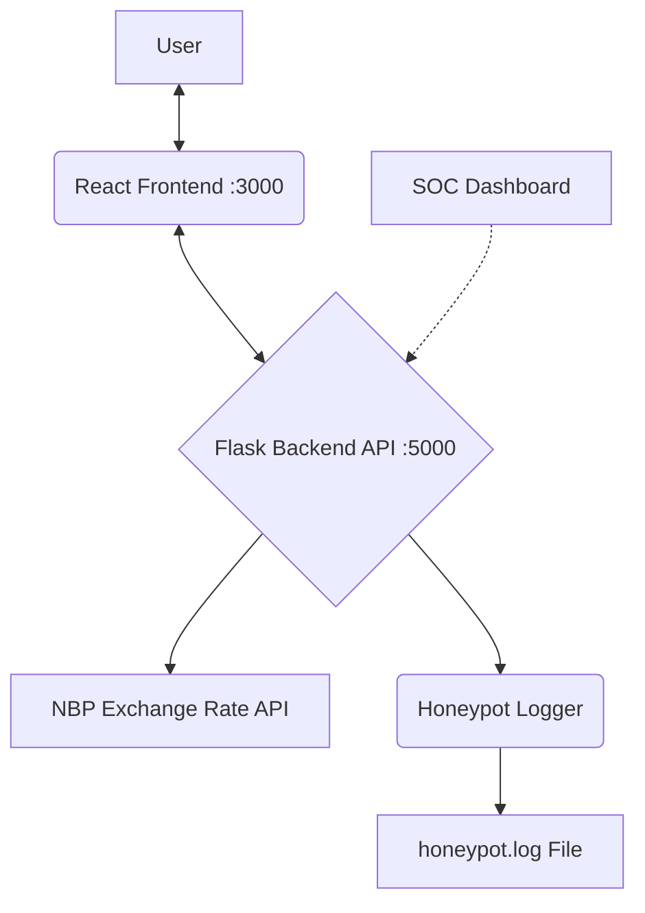

# SOC Bank Honeypot Dashboard

**SOC Bank Honeypot Dashboard** is a professional, visually appealing, and educational web application simulating an online banking system with integrated Security Operations Center (SOC) monitoring. Built with a modern React frontend and a Python Flask backend, this project demonstrates real-time detection, logging, and visualization of suspicious activities—key skills for SOC Analysts and cybersecurity professionals.

---

## ✨ Key Features

- **Realistic Online Banking Simulation:**  
  User dashboard with login, balance, recipient management, and EUR transfers.
- **SOC Monitoring Panel:**  
  Dedicated admin dashboard for live log monitoring, threat detection, and incident response.
- **Live Data Visualization:**  
  Color-coded tables for logs, suspicious events, and transfers, with support for light/dark mode.
- **Honeypot & Activity Logging:**  
  All login attempts, transfers, and suspicious actions are logged and visualized in real time.
- **Phishing & Attack Detection:**  
  Automated detection and alerting for brute-force, phishing, and anomalous transfer attempts.
- **Automated Test Data Generation:**  
  Simulate user activity and attacks for demo and training purposes.
- **Modern UI/UX:**  
  Responsive, accessible, and visually consistent design with clear separation of user and admin views.

---

## 👁️ Architecture Overview



- **Frontend:** React (with React Router, Context API, custom theming)
- **Backend:** Python Flask (REST API, in-memory user DB, logging, detection)
- **External API:** NBP (National Bank of Poland) for live EUR/PLN rates

---

## 📁 Project Structure

```
SOC-Bank-Honeypot/
├── backend/
│   ├── api/
│   │   ├── transfer.py         # Main Flask API logic
│   │   ├── honeypot_logger.py  # Logging system
│   │   ├── phishing_detector.py # Suspicious activity detection
│   │   ├── users_db.py         # In-memory user "database"
│   │   ├── fetcher.py          # Fetches exchange rates
│   │   └── utils.py            # Utility functions
│   ├── requirements.txt        # Python dependencies
│   └── honeypot.log            # Log file (generated on run)
├── frontend/
│   ├── public/                 # Static assets (index.html, favicon)
│   ├── src/
│   │   ├── components/         # React components (Dashboard, SOC, Tables, Forms)
│   │   ├── soc/                # SOC dashboard components
│   │   ├── context/            # Theme context
│   │   ├── styles/             # CSS (main.css: full theming & color-coding)
│   │   ├── App.jsx             # Main React application component
│   │   └── index.js            # React application entry point
│   ├── package.json            # Node.js dependencies and scripts
└── README.md                   # This file
```

---

## ⚙️ Installation and Setup

### Prerequisites

- Python 3.8+
- pip (Python package manager)
- Node.js 16+
- npm (Node.js package manager)

### 1. Backend Setup

```bash
cd SOC-Bank-Honeypot/backend
python -m venv venv
# On Windows:
venv\Scripts\activate
# On macOS/Linux:
source venv/bin/activate

pip install -r requirements.txt
```

Create a `.env` file in the `backend/` directory (do not commit this file!) and add:

```
API_TOKEN=your_secret_token_here
```

Start the backend server:

```bash
python -m api.transfer
# The backend will be running on http://localhost:5000
```

### 2. Frontend Setup (in another terminal)

```bash
cd SOC-Bank-Honeypot/frontend
npm install
npm start
# The application will open at http://localhost:3000
```

---

## 🚀 Usage / Demonstration

1. **Login:**
   - Use predefined credentials (see `backend/api/users_db.py`):
     - Username: `admin`, Password: `admin` (SOC Panel)
     - Username: `William`, Password: `tajnehaslo`
     - Username: `Emma`, Password: `qwerty`
     - ...and others

2. **User Dashboard:**
   - Make transfers, view your personal transaction history (only your own transfers).
   - All actions are logged and color-coded by severity.

3. **SOC Dashboard (admin only):**
   - Monitor all system logs, suspicious events, and live transfers.
   - See color-coded INFO, WARNING, and CRITICAL events in real time.
   - Simulate attacks and observe detection in action.

4. **Simulated Activity:**
   - The backend can generate random test events (transfers, failed logins, phishing attempts) for demo and training.

---

## 🛡️ Security & SOC Integration

- **Honeypot Logging:** All suspicious or malformed input is logged for analysis.
- **Phishing Detection:** The system tracks repeated suspicious attempts and generates CRITICAL logs.
- **SOC/SIEM Ready:** Logs are generated in a format suitable for SIEM platforms (Splunk, ELK, QRadar).
- **Incident Response Training:** Use the SOC dashboard to analyze logs and detect attack patterns.

---

## 🎨 Visuals & Theming

- **Color-coded tables:**  
  - INFO (green), WARNING (yellow), CRITICAL (red/purple) for instant threat visibility.
- **Light/Dark mode:**  
  - Toggle theme on login and in the SOC panel.
- **Responsive design:**  
  - Works on desktop and mobile.

---

## 🤖 AI & Development Process

  This project was developed iteratively, starting from basic HTML/CSS and evolving into a modern React application.  
  During development, I also used AI tools such as **GitHub Copilot** in Visual Studio Code to assist with code suggestions, refactoring, and UI improvements.  
  This approach demonstrates my ability to learn, adapt, and leverage modern tools to deliver professional results.

---

## 📝 Log Analysis

- All logs are saved to `backend/honeypot.log`.
- The SOC dashboard provides real-time log viewing and filtering.

---

## ⏹️ Stopping the Project

- To stop the backend server: `Ctrl+C` in the backend terminal.
- To stop the frontend server: `Ctrl+C` in the frontend terminal.

---

## ⚠️ Important

- **Never commit your `.env` file or any secrets to the repository.**
- Make sure `.env` is listed in `.gitignore`.
- The API token in `.env` must match the token used in frontend/backend requests (header: `X-API-KEY`).

---

**This project is for educational and demonstration purposes in cybersecurity and SOC operations.**